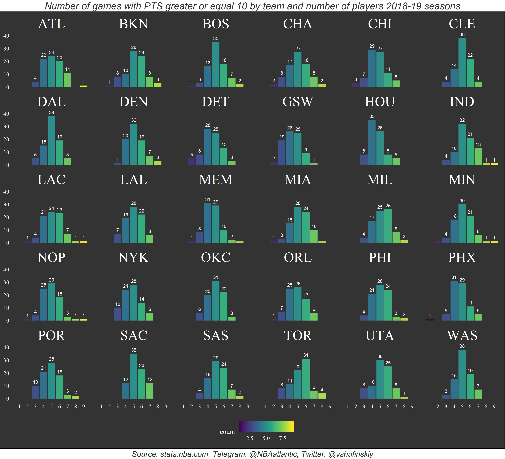
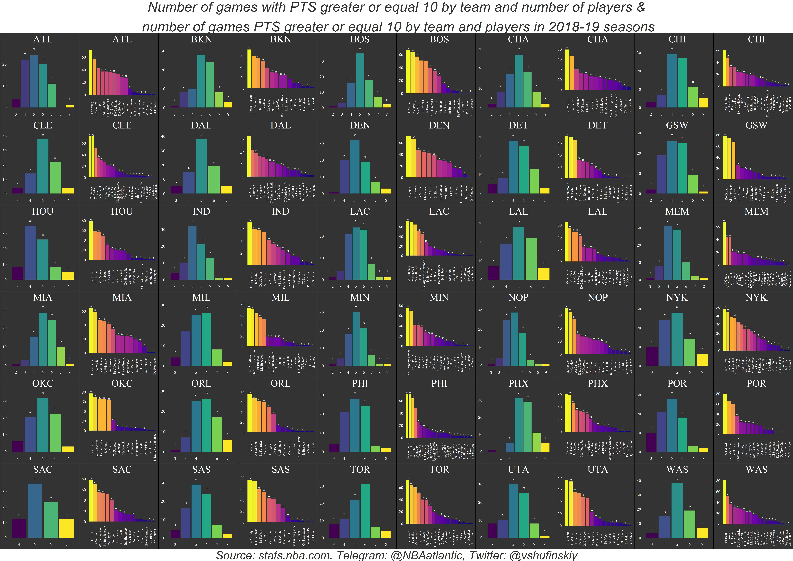
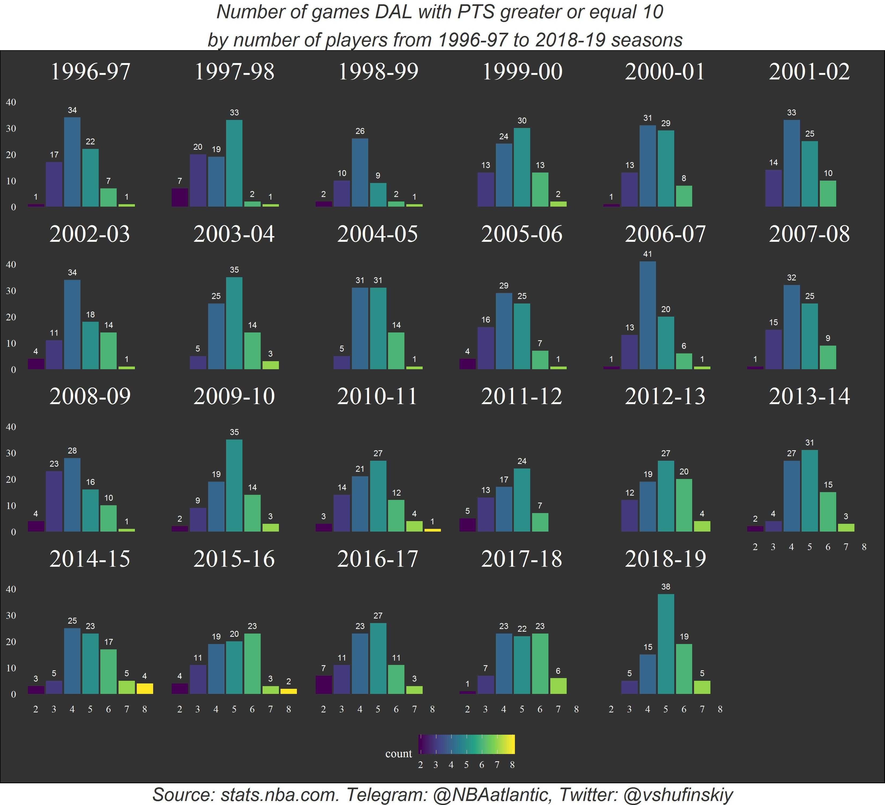
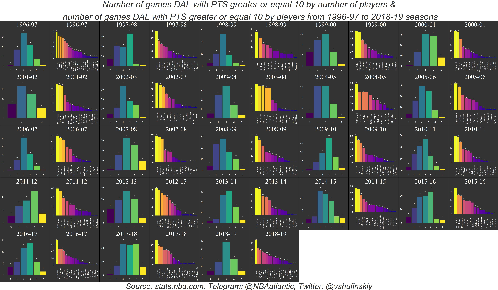

# plotting_nba_boxscore_data
Plotting using the lapply() function

# Распределение количества игр в сезоне 2018-19 по количеству игроков в команде, набравших 10 и более очков.
## calculate_season_stats_facet.R

# Распределение количества игр в сезоне 2018-19 по количеству игроков в команде, набравших 10 и более очков, а также общее количество таких игр у каждого игрока команды.
## calculate_season_stats.R

# Распределение количества игр Даллас Маверикс с сезона 1996-97 по количеству игроков в команде, набравших 10 и более очков.
## calculate_team_stats_facet.R

# Распределение количества игр Даллас Маверикс с сезона 1996-97 по количеству игроков в команде, набравших 10 и более очков, а также общее количество таких игр у каждого игрока команды.
## calculate_team_stats.R

